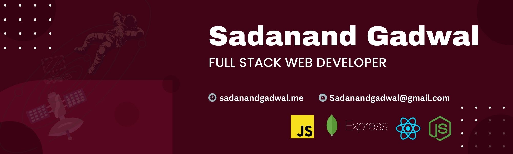

# 💫 About Me: I'm Sadanand Gadwal Here

🔭️ I Work on Javascript Tools like React & Express  🧑‍💻️ All my projects and experience are available at SadanandGadwal.me   💬️ Ask me about React | Javascript   📫 How to reach me Sadanandgadwal@gmail.com 

## 🌐 Socials:
      

# 💻 Tech Stack:
                     	  
# 📊 GitHub Stats:
 
 

---

<!-- Proudly created with GPRM ( https://gprm.itsvg.in ) -->
